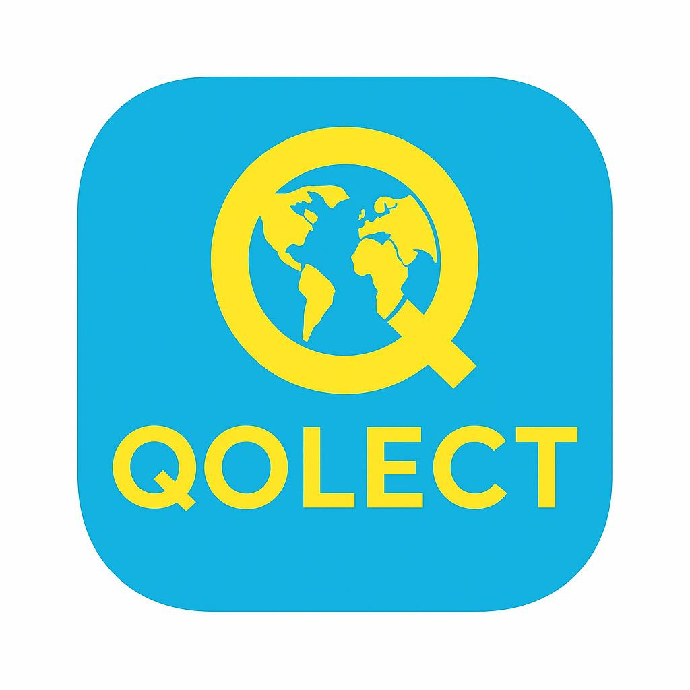

<html lang="es">
<head>
    <meta charset="UTF-8">
    <meta name="viewport" content="width=device-width, initial-scale=1.0">
    <title>Test de Perfil de Viajero</title>
    
    
</head>
<body class="bg-gray-100 flex items-center justify-center min-h-screen">

    

        
        

             
            

        <h1 class="text-3xl font-bold text-center text-gray-800 mb-6">Perfil de Viajero</h1>

        

            <h3 class="text-lg font-semibold text-yellow-700 mb-2">Test de Calibración (Basado en David R. Hawkins)</h3>
            

                Este test utiliza principios de la Escala de Conciencia de David R. Hawkins (desde la **Vergüenza** hasta la **Paz**). Tus respuestas nos ayudarán a calibrar tu estado actual de conciencia, energía y percepción, revelando tu **perfil de viajero energético**.
            

        

        

            
Por favor, completa tus datos para iniciar el test.

            <form id="userDataForm" class="space-y-4">
                

                    <label for="nombre" class="block text-sm font-medium text-gray-700">Nombre Completo</label>
                    <input type="text" id="nombre" name="nombre" required class="mt-1 block w-full px-4 py-2 border border-gray-300 rounded-lg shadow-sm focus:outline-none focus:ring-blue-500 focus:border-blue-500">
                

                

                    <label for="telefono" class="block text-sm font-medium text-gray-700">Teléfono</label>
                    <input type="tel" id="telefono" name="telefono" required class="mt-1 block w-full px-4 py-2 border border-gray-300 rounded-lg shadow-sm focus:outline-none focus:ring-blue-500 focus:border-blue-500">
                

                

                    <label for="correo" class="block text-sm font-medium text-gray-700">Correo Electrónico</label>
                    <input type="email" id="correo" name="correo" required class="mt-1 block w-full px-4 py-2 border border-gray-300 rounded-lg shadow-sm focus:outline-none focus:ring-blue-500 focus:border-blue-500">
                

                            
                

                
                <button type="submit" class="w-full bg-blue-600 text-white font-bold py-3 px-6 rounded-lg shadow-lg hover:bg-blue-700 transition duration-300">
                    Iniciar Test
                </button>
            </form>
        

        

            
Selecciona la respuesta que mejor te represente.

            <form id="quizForm" class="space-y-6">
                
                <fieldset class="space-y-2">
                    <legend class="text-lg font-semibold text-gray-800">1. ¿Cómo reaccionas ante un error inesperado en tu vida o trabajo?</legend>
                    

                        <input type="radio" id="q1a1" name="q1" value="1" class="hidden">
                        <label for="q1a1" class="block w-full p-4 border border-gray-300 rounded-lg cursor-pointer hover:bg-gray-50">a) Siento culpa y me critico duramente por la negligencia.</label>
                        
                        <input type="radio" id="q1a2" name="q1" value="2" class="hidden">
                        <label for="q1a2" class="block w-full p-4 border border-gray-300 rounded-lg cursor-pointer hover:bg-gray-50">b) Analizo objetivamente lo sucedido y busco una solución práctica.</label>
                        
                        <input type="radio" id="q1a3" name="q1" value="3" class="hidden">
                        <label for="q1a3" class="block w-full p-4 border border-gray-300 rounded-lg cursor-pointer hover:bg-gray-50">c) Lo veo como una oportunidad perfecta para aprender y crecer.</label>
                        
                    

                </fieldset>

                <fieldset class="space-y-2">
                    <legend class="text-lg font-semibold text-gray-800">2. ¿Cuál es tu actitud predominante ante el futuro de la humanidad?</legend>
                    

                        <input type="radio" id="q2a1" name="q2" value="1" class="hidden">
                        <label for="q2a1" class="block w-full p-4 border border-gray-300 rounded-lg cursor-pointer hover:bg-gray-50">a) Miedo e incertidumbre, siento que vamos hacia el caos.</label>
                        
                        <input type="radio" id="q2a2" name="q2" value="2" class="hidden">
                        <label for="q2a2" class="block w-full p-4 border border-gray-300 rounded-lg cursor-pointer hover:bg-gray-50">b) Soy optimista, creo que podemos hacer un cambio si actuamos con voluntad.</label>
                        
                        <input type="radio" id="q2a3" name="q2" value="3" class="hidden">
                        <label for="q2a3" class="block w-full p-4 border border-gray-300 rounded-lg cursor-pointer hover:bg-gray-50">c) Tengo una paz profunda, sé que todo se desarrolla en perfecto orden.</label>
                        
                        
                    

                </fieldset>

                <fieldset class="space-y-2">
                    <legend class="text-lg font-semibold text-gray-800">3. Al tomar una decisión importante, ¿qué te guía principalmente?</legend>
                    

                        <input type="radio" id="q3a1" name="q3" value="1" class="hidden">
                        <label for="q3a1" class="block w-full p-4 border border-gray-300 rounded-lg cursor-pointer hover:bg-gray-50">a) La presión o el deseo de obtener una ganancia o estatus.</label>
                        
                        <input type="radio" id="q3a2" name="q3" value="2" class="hidden">
                        <label for="q3a2" class="block w-full p-4 border border-gray-300 rounded-lg cursor-pointer hover:bg-gray-50">b) Busco información, uso la lógica y considero los pros y contras.</label>
                        
                        <input type="radio" id="q3a3" name="q3" value="3" class="hidden">
                        <label for="q3a3" class="block w-full p-4 border border-gray-300 rounded-lg cursor-pointer hover:bg-gray-50">c) Escucho mi intuición y actúo desde el amor incondicional.</label>
                        
                    
                    

                </fieldset>

                <fieldset class="space-y-2">
                    <legend class="text-lg font-semibold text-gray-800">4. Cuando ves el éxito de otra persona, ¿cuál es tu sentimiento inmediato?</legend>
                    

                        <input type="radio" id="q4a1" name="q4" value="1" class="hidden">
                        <label for="q4a1" class="block w-full p-4 border border-gray-300 rounded-lg cursor-pointer hover:bg-gray-50">a) Envidia o el deseo de tener lo que ellos tienen (deseo/ira).</label>
                        
                        <input type="radio" id="q4a2" name="q4" value="2" class="hidden">
                        <label for="q4a2" class="block w-full p-4 border border-gray-300 rounded-lg cursor-pointer hover:bg-gray-50">b) Reconozco su esfuerzo y me inspiro para lograr mis propias metas..</label>
                        
                        <input type="radio" id="q4a3" name="q4" value="3" class="hidden">
                        <label for="q4a3" class="block w-full p-4 border border-gray-300 rounded-lg cursor-pointer hover:bg-gray-50">c) Alegría genuina por su prosperidad y bienestar.</label>
                        
            
                    

                </fieldset>

                    <fieldset class="space-y-2">
                    <legend class="text-lg font-semibold text-gray-800">5. ¿Cómo manejas una crítica o un desacuerdo con alguien cercano?</legend>
                    

                        <input type="radio" id="q5a1" name="q5" value="1" class="hidden">
                        <label for="q5a1" class="block w-full p-4 border border-gray-300 rounded-lg cursor-pointer hover:bg-gray-50">a) Me pongo a la defensiva y siento que debo ganar la discusión (orgullo/ira).</label>
                        
                        <input type="radio" id="q5a2" name="q5" value="2" class="hidden">
                        <label for="q5a2" class="block w-full p-4 border border-gray-300 rounded-lg cursor-pointer hover:bg-gray-50">b) Me mantengo neutral y escucho el punto de vista del otro con respeto.</label>
                        
                        <input type="radio" id="q5a3" name="q5" value="3" class="hidden">
                        <label for="q5a3" class="block w-full p-4 border border-gray-300 rounded-lg cursor-pointer hover:bg-gray-50">c) Ofrezco comprensión y busco la armonía, aceptando la diferencia.</label>
                        
                        
                    

                </fieldset>
                
                

                    Por favor, responde todas las preguntas.
                

                <button type="submit" class="w-full bg-green-600 text-white font-bold py-3 px-6 rounded-lg shadow-lg hover:bg-green-700 transition duration-300">
                    Validando tu Perfil
                </button>
            </form>
        

        

            <h2 class="text-2xl font-bold text-gray-800 mb-4">¡Gracias por completar el test!</h2>
            
Hola ,

            
Tu puntaje total es: 

            

                <h3 class="text-xl font-semibold text-blue-800 mb-2">Tu Perfil de viajero es:</h3>
                

                

            

            <button id="restartButton" class="mt-6 bg-gray-500 text-white font-bold py-2 px-6 rounded-lg hover:bg-gray-600 transition duration-300">
                Volver a empezar
            </button>
        

    

    

</body>
</html>
